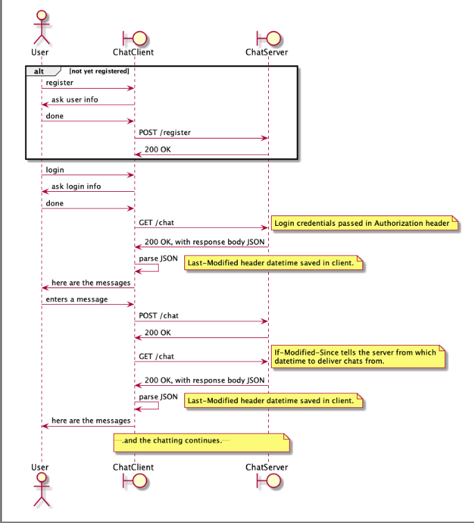

# ChatServer
This is an HTTPS server I created for a university course.    

Features:  
- HTTPS
- Authentication
- SQL-database
- Password hashing and salting
- Multi threading  
- Uses Last-Modified and If-Modified-Since headers to save bandwith    

Compiling:
```bash
mvn package
```

Running the server requires 3 arguments:  
- Path and file name to a database (database doesn't have to exist, database is created in the given path with the given name)
- HTTPS certificate path and file name
- Password of the certificate

For example with database.db and keystore.jks files in the "ChatServer" folder:
```bash
java -cp target/chatserver-1.0-SNAPSHOT-jar-with-dependencies.jar com.nuutti.chatserver.ChatServer database.db keystore.jks password
```

Course API requirements:
- REQ-001 All text in HTTP body must be UTF-8
- REQ-002 All content in the HTTP requests and responses must be JSON except for the error messages
- REQ-003 All dates and times in JSON content must follow the ISO 8601 date format in UTC time zone with milliseconds
- REQ-004 All datetimes in HTTP headers must follow the "HTTP-date" format as defined by RFC 7231 with milliseconds
- REQ-005 All binary data must be base64 encoded
- REQ-006 HTTP headers must contain the content size in bytes and content type using standard HTTP headers
- REQ-007 All HTTP requests except for registration must contain authentication credentials
- REQ-008 HTTP header Content-Type must be "application-json"
- REQ-009 Client and server must use Last-Modified and If-Modified-Since headers with chat message requests and responses to make sure only recent data is provided by the server for each client    


This UML interaction diagram gives an overall view of the communication between the server and a client:
  

